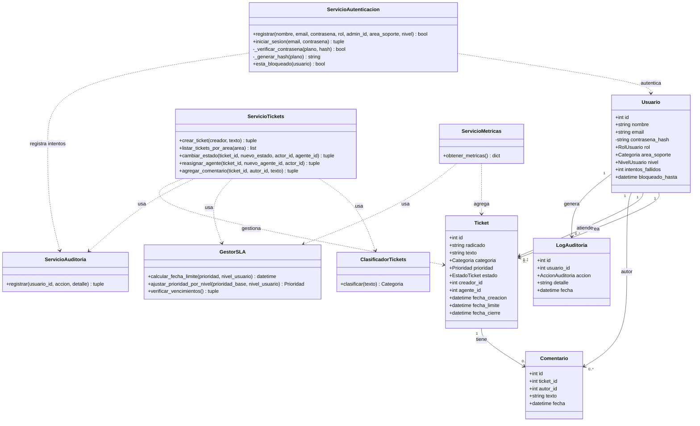
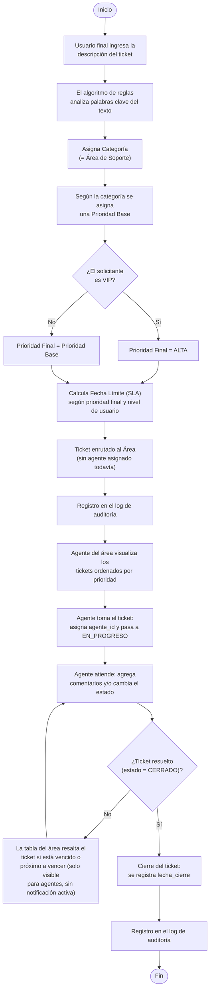

# Avances de arquitectura

## Stack tecnológico

| Componente | Tecnología | Justificación |
|---|---|---|
| Backend | Python + Flask | Framework simple, sin sobre-ingeniería, adecuado para el tamaño del equipo y el tiempo disponible. |
| Base de datos | SQLite | Cero configuración de servidor, suficiente para el volumen de datos del proyecto. |
| ORM | SQLAlchemy (Flask-SQLAlchemy) | Evita escribir SQL a mano para las operaciones básicas y mantiene el modelo de datos como código Python. |
| Frontend | HTML/CSS + plantillas Jinja2 (Bootstrap 5 vía CDN) | Sin framework de frontend adicional, evitando complejidad innecesaria. |
| Control de versiones | Git + GitHub | Historial de commits como evidencia de aporte individual de cada integrante del equipo. |

## Modelo de datos

| Entidad | Campos principales |
|---|---|
| **Usuario** | id, nombre, email, contrasena_hash, rol (final/agente/admin), area_soporte (solo aplica si es agente; se guarda como `Categoria`), nivel (normal/VIP), intentos_fallidos, bloqueado_hasta |
| **Ticket** | id, radicado, texto, categoria, prioridad, estado, creador_id, agente_id, fecha_creacion, fecha_limite, fecha_cierre |
| **Comentario** | id, ticket_id, autor_id, texto, fecha |
| **LogAuditoria** | id, usuario_id, accion (enum `AccionAuditoria`), detalle, fecha |

## Separación de responsabilidades

Siguiendo el principio de responsabilidad única, la lógica de negocio se separa de las
entidades de datos en clases de servicio independientes:

| Clase de servicio | Responsabilidad |
|---|---|
| `ServicioAutenticacion` | Registro de usuarios (`registrar`, requiere `rol` y `admin_id`), verificación de credenciales (`iniciar_sesion`), generación/verificación de hash de contraseña y control de bloqueo por intentos fallidos. Única clase autorizada a manejar contraseñas en texto plano. |
| `ClasificadorTickets` | Determina únicamente la **categoría** de un ticket a partir de su texto, por coincidencia de palabras clave. No calcula prioridad. |
| `ServicioTickets` | Orquesta el ciclo de vida completo del ticket: crear (aplica clasificación, prioridad base, ajuste VIP y SLA), listar por área, cambiar estado (valida transiciones), reasignar agente y agregar comentarios. |
| `GestorSLA` | Calcula la fecha límite de atención según la prioridad final **y el nivel del usuario**, ajusta la prioridad por nivel VIP, y verifica qué tickets están vencidos o próximos a vencer. |
| `ServicioAuditoria` | Registra cada acción crítica en `LogAuditoria`, con un reintento automático si el primer guardado falla. |
| `ServicioMetricas` | Calcula los conteos agregados que alimenta el panel del administrador (tickets por estado/categoría/prioridad, vencidos, próximos a vencer, cantidad de agentes). |

## Diagrama de clases

## Diagrama de flujo

## Estado actual de la implementación

- [x] Modelos de datos (`Usuario`, `Ticket`, `Comentario`, `LogAuditoria`) implementados y
      verificados contra la base de datos real.
- [x] `create_app()`, `init_db.py` y conexión de la base de datos funcionando.
- [x] `ServicioAutenticacion`: generación/verificación de hash de contraseña (bcrypt), registro
      completo de usuarios y control de bloqueo por intentos fallidos.
- [x] `ClasificadorTickets` y `ServicioTickets` (creación, cambio de estado, reasignación,
      comentarios).
- [x] `GestorSLA` (cálculo de fecha límite por prioridad y nivel, verificación de vencimientos).
- [x] `ServicioAuditoria` integrado al flujo de la aplicación (login, registro, tickets,
      comentarios, bloqueos).
- [x] `ServicioMetricas` y panel de métricas para el administrador (`/dashboard`).
- [x] Interfaz web completa (login, registro, crear ticket, listar por área, detalle de
      ticket, dashboard).
- [ ] Pantalla para que el administrador **consulte** el log de auditoría (RF-10 / CU-06). El
      log se escribe correctamente, pero no hay ruta ni plantilla para leerlo todavía.
- [ ] Recordatorio de SLA visible para el **creador** del ticket, no solo para el agente
      (RF-07).
- [ ] Renombrar `app/Templates/` a `app/templates/` para evitar el riesgo de portabilidad
      descrito en `02_estructura.md`.
