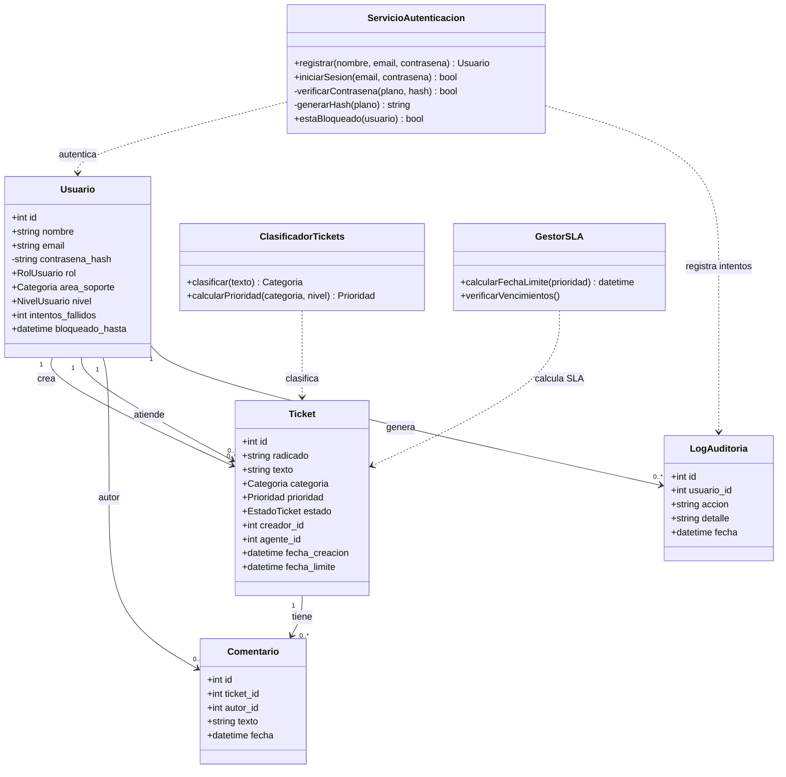

# Avances de arquitectura

## Stack tecnológico

| Componente | Tecnología | Justificación |
|---|---|---|
| Backend | Python + Flask | Framework simple, sin sobre-ingeniería, adecuado para el tamaño del equipo y el tiempo disponible. |
| Base de datos | SQLite | Cero configuración de servidor, suficiente para el volumen de datos del proyecto. |
| ORM | SQLAlchemy (Flask-SQLAlchemy) | Evita escribir SQL a mano para las operaciones básicas y mantiene el modelo de datos como código Python. |
| Frontend | HTML/CSS + plantillas Jinja2 | Sin framework de frontend adicional, evitando complejidad innecesaria. |
| Control de versiones | Git + GitHub | Historial de commits como evidencia de aporte individual de cada integrante del equipo. |

## Modelo de datos

| Entidad | Campos principales |
|---|---|
| **Usuario** | id, nombre, email, contraseña_hash, rol (final/agente/admin), área_soporte (si es agente), nivel (normal/VIP), intentos_fallidos, bloqueado_hasta |
| **Ticket** | id, radicado, texto, categoría, prioridad, estado, creador_id, agente_id, fecha_creación, fecha_límite |
| **Comentario** | id, ticket_id, autor_id, texto, fecha |
| **LogAuditoria** | id, usuario_id, acción, detalle, fecha |

## Separación de responsabilidades

Siguiendo el principio de responsabilidad única, la lógica de negocio se separa de las entidades de datos en clases de servicio independientes:

| Clase de servicio | Responsabilidad |
|---|---|
| `ServicioAutenticacion` | Registro de usuarios, verificación de credenciales, generación de hash de contraseña y control de bloqueo por intentos fallidos. Única clase autorizada a manejar contraseñas en texto plano. |
| `ClasificadorTickets` | Determina categoría, área de soporte y prioridad base de un ticket a partir de su texto. |
| `GestorSLA` | Calcula la fecha límite de atención según la prioridad final y verifica qué tickets están próximos a vencer. |

## Diagrama de clases

*(Este bloque se renderiza automáticamente como diagrama al verlo en GitHub.)*

## Estado actual de la implementación

- [x] Modelos de datos (`Usuario`, `Ticket`, `Comentario`, `LogAuditoria`) implementados y verificados contra la base de datos real.
- [x] `create_app()` y conexión de la base de datos funcionando.
- [x] `ServicioAutenticacion`: generación y verificación de hash de contraseña (bcrypt).
- [ ] `ServicioAutenticacion`: registro completo de usuarios y control de bloqueo por intentos fallidos.
- [ ] `ClasificadorTickets`.
- [ ] `GestorSLA`.
- [ ] Log de auditoría integrado al flujo de la aplicación.
- [ ] Interfaz web (plantillas HTML).
