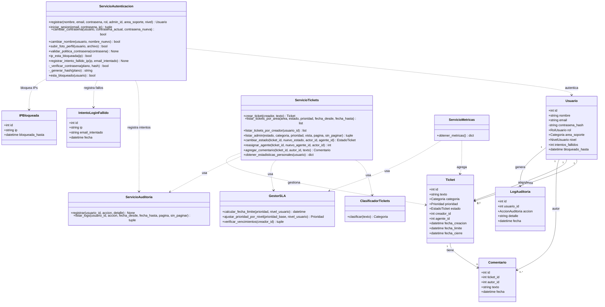
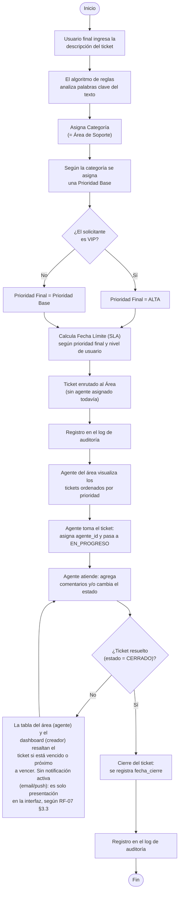

# Avances de arquitectura

## Stack tecnológico

| Componente | Tecnología | Justificación |
|---|---|---|
| Backend | Python + Flask | Framework simple, sin sobre-ingeniería, adecuado para el tamaño del equipo y el tiempo disponible. |
| Base de datos | SQLite | Cero configuración de servidor, suficiente para el volumen de datos del proyecto. |
| ORM | SQLAlchemy (Flask-SQLAlchemy) | Evita escribir SQL a mano para las operaciones básicas y mantiene el modelo de datos como código Python. |
| Frontend | HTML/CSS + plantillas Jinja2 (Bootstrap 5 vía CDN) | Sin framework de frontend adicional, evitando complejidad innecesaria. |
| Control de versiones | Git + GitHub | Historial de commits como evidencia de aporte individual de cada integrante del equipo. |
| Seguridad | Flask-WTF (CSRF), bcrypt (hash de contraseñas) | Protección contra CSRF en formularios y almacenamiento seguro de contraseñas. |
| Tareas en segundo plano | APScheduler | Limpieza periódica de registros de intentos de login fallidos, sin depender de un cron externo del sistema operativo. |
| Manejo de imágenes | Pillow | Validación de que un archivo subido como foto de perfil es realmente una imagen válida, no solo su extensión. |
| Exportación de datos | openpyxl + módulo `csv` estándar | Generación de reportes en Excel y CSV desde tickets, métricas y auditoría. |
| Pruebas | pytest | Suite de pruebas automatizadas con fixtures, reemplazando los scripts manuales iniciales. |
| Integración continua | GitHub Actions | Ejecuta la suite de pytest automáticamente en cada push/PR hacia `main`. |

## Modelo de datos

| Entidad | Campos principales |
|---|---|
| **Usuario** | id, nombre, email, contrasena_hash, rol (final/agente/admin), area_soporte (solo aplica si es agente; se guarda como `Categoria`), nivel (normal/VIP), intentos_fallidos, bloqueado_hasta |
| **Ticket** | id, texto, categoria, prioridad, estado, creador_id, agente_id, fecha_creacion, fecha_limite, fecha_cierre |
| **Comentario** | id, ticket_id, autor_id, texto, fecha |
| **LogAuditoria** | id, usuario_id, accion (enum `AccionAuditoria`), detalle, fecha |
| **IntentoLoginFallido** | id, ip, email_intentado, fecha — registra cada fallo de login (exista o no ese usuario), fuente para la detección de bloqueo por IP |
| **IPBloqueada** | id, ip (único), bloqueada_hasta — bloqueo activo de una IP, generado cuando 5 emails distintos fallan desde la misma IP en 1 hora |

**Nota:** el campo `radicado` que existía en versiones anteriores del modelo `Ticket` se
eliminó en la versión 1.2 — ver `07_avances.md`.

## Separación de responsabilidades

Siguiendo el principio de responsabilidad única, la lógica de negocio se separa de las
entidades de datos en clases de servicio independientes:

| Clase de servicio | Responsabilidad |
|---|---|
| `ServicioAutenticacion` | Registro de usuarios (`registrar`, requiere `rol` y `admin_id`), verificación de credenciales (`iniciar_sesion`), generación/verificación de hash de contraseña, control de bloqueo por intentos fallidos por usuario y por IP (`ip_esta_bloqueada`, `registrar_intento_fallido_ip`), política de contraseñas (`validar_politica_contrasena`), y autoservicio de perfil (`cambiar_contrasena`, `cambiar_nombre`, `subir_foto_perfil`). Única clase autorizada a manejar contraseñas en texto plano. |
| `ClasificadorTickets` | Determina únicamente la **categoría** de un ticket a partir de su texto, por coincidencia de palabras clave. No calcula prioridad. |
| `ServicioTickets` | Orquesta el ciclo de vida completo del ticket: crear (aplica clasificación, prioridad base, ajuste VIP y SLA), listar por área con filtros, listar por creador, listar globalmente para el administrador con filtros y vistas especiales de SLA (`listar_admin`), cambiar estado (valida transiciones), reasignar agente, agregar comentarios y calcular estadísticas personales de un usuario (`obtener_estadisticas_personales`). |
| `GestorSLA` | Calcula la fecha límite de atención según la prioridad final **y el nivel del usuario**, ajusta la prioridad por nivel VIP, y verifica qué tickets están vencidos o próximos a vencer — opcionalmente filtrado por creador. |
| `ServicioAuditoria` | Registra cada acción crítica en `LogAuditoria`, con un reintento automático si el primer guardado falla, y permite consultarlo con filtros y paginación (`listar_logs`). |
| `ServicioMetricas` | Calcula los conteos agregados que alimenta el panel del administrador (tickets por estado/categoría/prioridad, vencidos, próximos a vencer, vencidos últimos 30 días, cantidad de agentes). |

## Diagrama de clases

## Diagrama de flujo

## Estado actual de la implementación

- [x] Modelos de datos (`Usuario`, `Ticket`, `Comentario`, `LogAuditoria`) implementados y
      verificados contra la base de datos real.
- [x] `create_app()`, `init_db.py` y conexión de la base de datos funcionando.
- [x] `ServicioAutenticacion`: generación/verificación de hash de contraseña (bcrypt), registro
      completo de usuarios y control de bloqueo por intentos fallidos.
- [x] `ClasificadorTickets` y `ServicioTickets` (creación, cambio de estado, reasignación,
      comentarios).
- [x] `GestorSLA` (cálculo de fecha límite por prioridad y nivel, verificación de vencimientos).
- [x] `ServicioAuditoria` integrado al flujo de la aplicación (login, registro, tickets,
      comentarios, bloqueos).
- [x] `ServicioMetricas` y panel de métricas para el administrador (`/dashboard`).
- [x] Interfaz web completa (login, registro, crear ticket, listar por área, detalle de
      ticket, dashboard, panel de métricas, auditoría, perfil, listado admin global).
- [x] Pantalla para que el administrador consulte el log de auditoría, con filtros,
      paginación y exportación a CSV/Excel (RF-10 / CU-06).
- [x] Recordatorio de SLA visible tanto para el agente como para el creador del ticket
      (RF-07).
- [x] Renombrado `app/Templates/` → `app/templates/` y `app/Static/` → `app/static/`.
- [x] Autoservicio de perfil: cambio de contraseña, cambio de nombre, foto de perfil,
      estadísticas personales/de agente (CU-08).
- [x] Filtros (estado, prioridad, fecha) en el listado por área, y listado administrativo
      global con las mismas capacidades más vistas especiales de SLA (CU-04, CU-09).
- [x] Eliminación del campo `radicado` del modelo `Ticket`.
- [x] Seguridad: CSRF en los 6 formularios, política de contraseñas, bloqueo por usuario
      (3 intentos/5h) y por IP (5 emails distintos/1h → 3h, con limpieza automática cada
      90 min vía `APScheduler`) (CU-10).
- [x] Drill-down de métricas y exportación a CSV/Excel de tickets, métricas y auditoría.
- [x] Rediseño visual completo de la interfaz.
- [x] Suite de pruebas migrada a `pytest` con fixtures (`tests/conftest.py`), corriendo
      automáticamente en cada push/PR vía GitHub Actions (`.github/workflows/tests.yml`).
